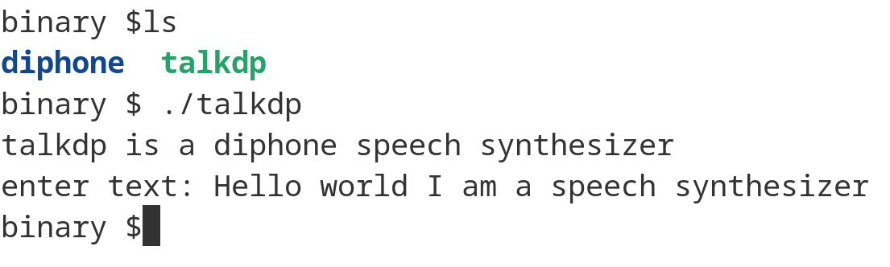

# Diphone Speech Synthesizer (talkdp)

talkdp (dp for diphone) is a Linux command line diphone speech synthesizer. It has been written in C++. 

### Prebuilt Binary

A 64 bit prebuilt binary for talkdp is available and can be downloaded from the binary folder. This has been built using Debian 12 Bookworm. Download and extract. The talkdp executable can be run from a terminal.

```
./talkdp
```

A screenshot of talkdp is shown below.



The talkdp must have executable permissions. Use the command below if necessary.

```
chmod +x talkdp
```

The diphone directory should be located in the current working directory.

## How is Speech Generated?

Words are formed as sequences of elementary speech units. A phoneme is the smallest unit of sound that distinguishes one word from another word and there are 44 phonemes in the English language. A diphone is a sound unit composed of two adjacent partial phonemes i.e. the second half of the first phoneme and the first half of the second phoneme. The synthesizer uses a set of pre-recorded diphone sound samples and concatenates diphone wav files to produce speech output for a given text input.

The folder containing the diphone wav files should be placed into the application binary (executable) working directory. The diphone collection was created by Alan W Black and Kevin Lenzo and more information can be found using the links in the Acknowledgements. The diphone license can be found [here](https://github.com/hypnaceae/DiphoneSynth/blob/master/diphones_license.txt).

The diphone speech synthesizer uses a small dictionary of approximately 56,600 English words. If a word is not recognised by the dictionary it is skipped over. More words will be added in future updates.

## Audio

I have used the Advanced Linux Sound Architecture (ALSA) library [aplay](https://alsa.opensrc.org/Aplay) program for audio output. If building a desktop from a Debian base install you will need to install ALSA as shown below but otherwise this is installed by default.

```
sudo apt install alsa-utils
```

Debian 12 GNOME provides Pipewire as the default audio server. Pipewire aims to improve audio and video handling in Linux systems replacing PulseAudio. To verify the version of Pipewire installed, run the command:

```
pipewire --version
```

I originally used [pw-play](https://www.thegeekdiary.com/pw-play-command-examples-in-linux/) to play audio output but found that PipeWire was not installed by default when using Debain Xfce and reverted to using ALSA aplay

## Sample Phrases

Pre-processing of input text is very limited at this stage just removing unwanted characters such as commas, exclamation marks and question marks. Some sample phrases for testing talkdp are shown below

```
Hello world I am a diphone speech synthesizer 

I am a text to speech converter

Mary had a little lamb, It's fleece was white as snow And everywhere that Mary went? The lamb was sure to go!

Talk diphone speech synthesizer wishes you a merry christmas and a happy new year.
```

## Build From Source

The C++ source code for talkdp is provided in the src directory.

With both  Debian Bookworm and Ubuntu and you need to install the following packages to compile talkdp.

```
sudo apt install build-essential
sudo apt install cmake
```

Make a build directory and use the cd command to change into this. Then run cmake followed by make as shown below.

```
mkdir build
cd build
cmake ..
make
```

## Versioning

[SemVer](http://semver.org/) is used for versioning. The version number has the form 0.0.0 representing major, minor and bug fix changes.

## Author

* **Alan Crispin** [Github](https://github.com/crispinprojects)

## License

The diphone speech synthesizer called talkdp is licensed under LGPL v2.1. 

## Project Status

Active.

## Acknowledgements

* [Diphone Source and License](https://github.com/hypnaceae/DiphoneSynth/blob/master/diphones_license.txt)

* Diphone collection and synthesis Alan W. Black and Kevin Lenzo [2000](https://www.cs.cmu.edu/~awb/papers/ICSLP2000_diphone.pdf)
